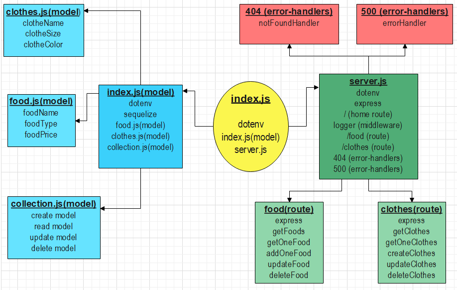
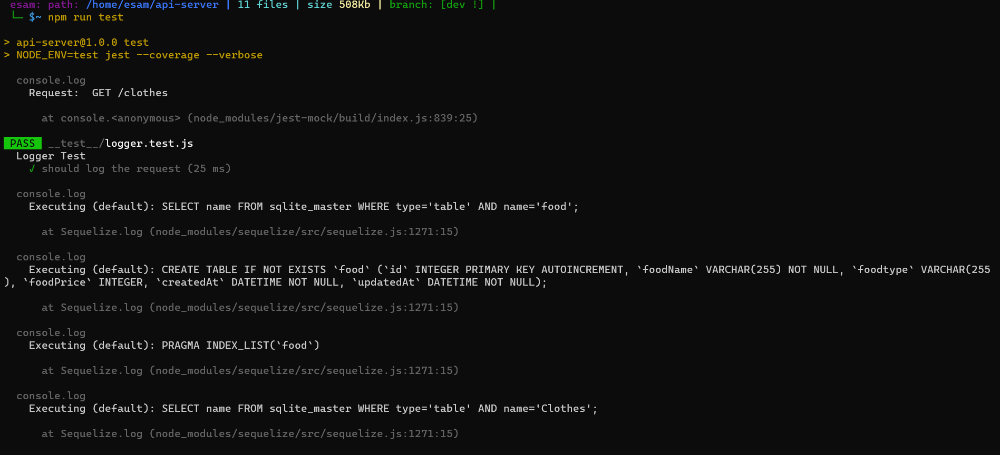
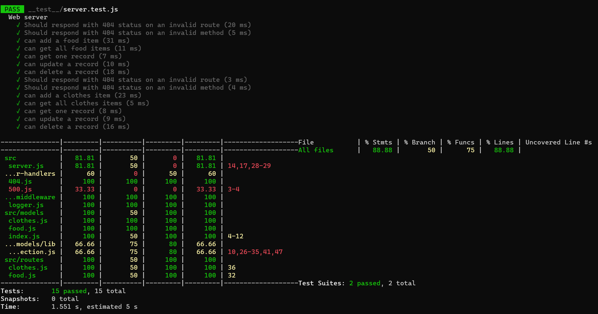
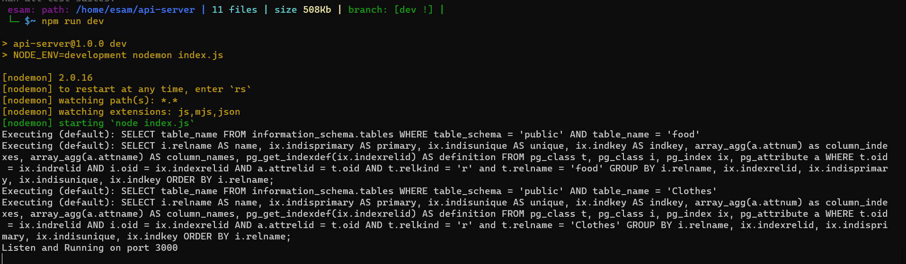
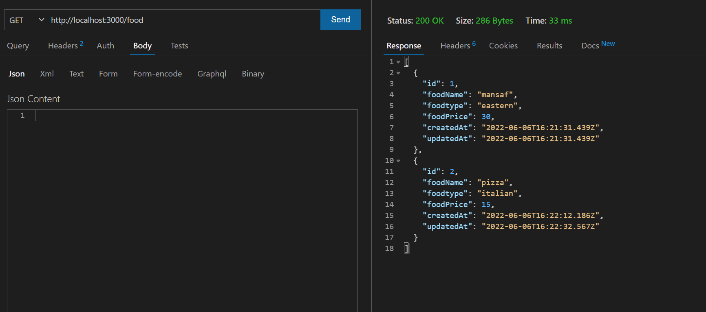
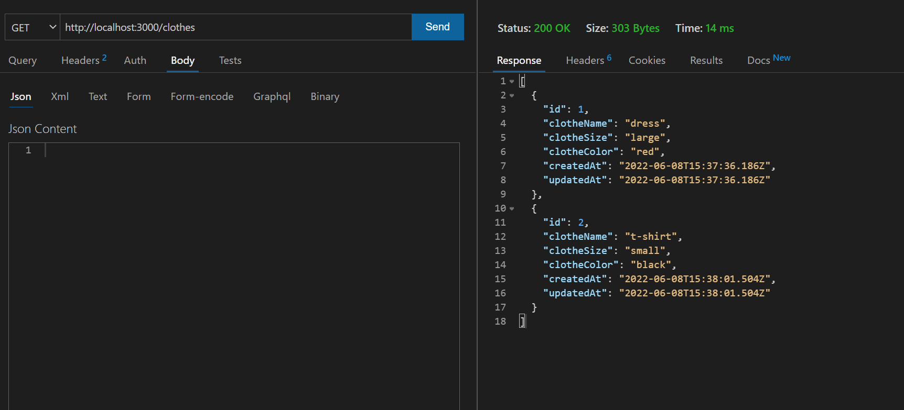
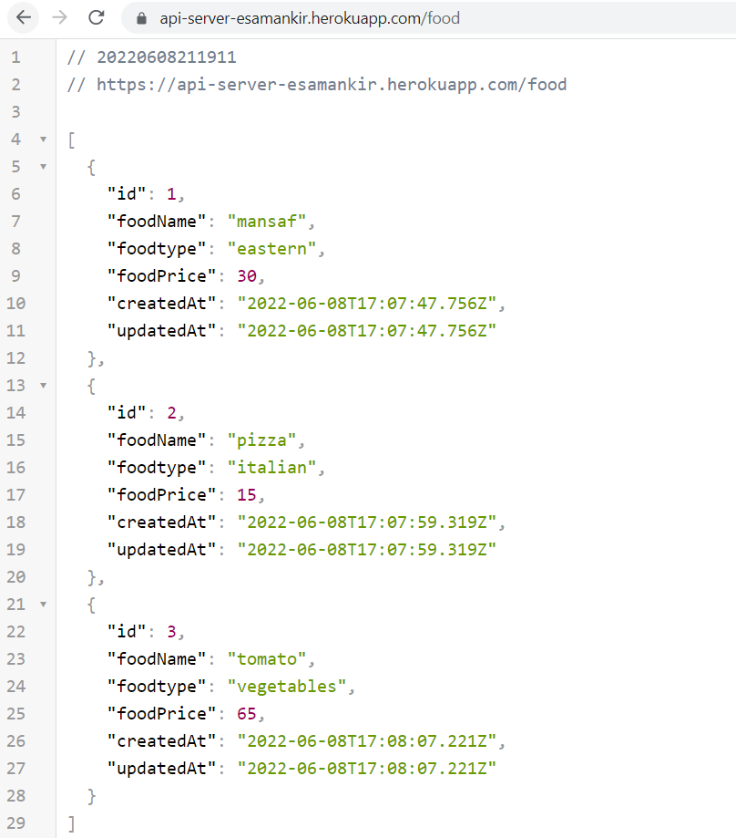
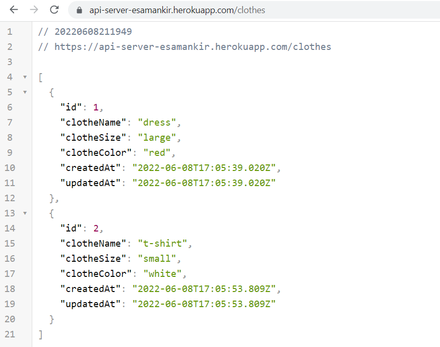

# api-server
Dynamic API Phase 3: Adding Database Abstraction and Associations to API

***Author: Esam Ankir***

# Submition Links

## GitHub Repo:

[GitHub Repo](https://github.com/Esam-Ankir/api-server) 

[Actions](https://github.com/Esam-Ankir/api-server/actions)

## Heroku deployment:

[home page](https://api-server-esamankir.herokuapp.com/)

[food route](https://api-server-esamankir.herokuapp.com/food) 

[clothes route](https://api-server-esamankir.herokuapp.com/clothes)

## UML diagram for this server:

## Work process screenshots:

